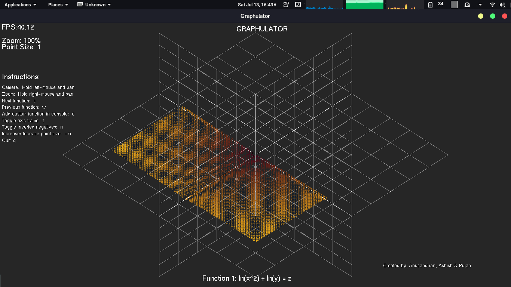
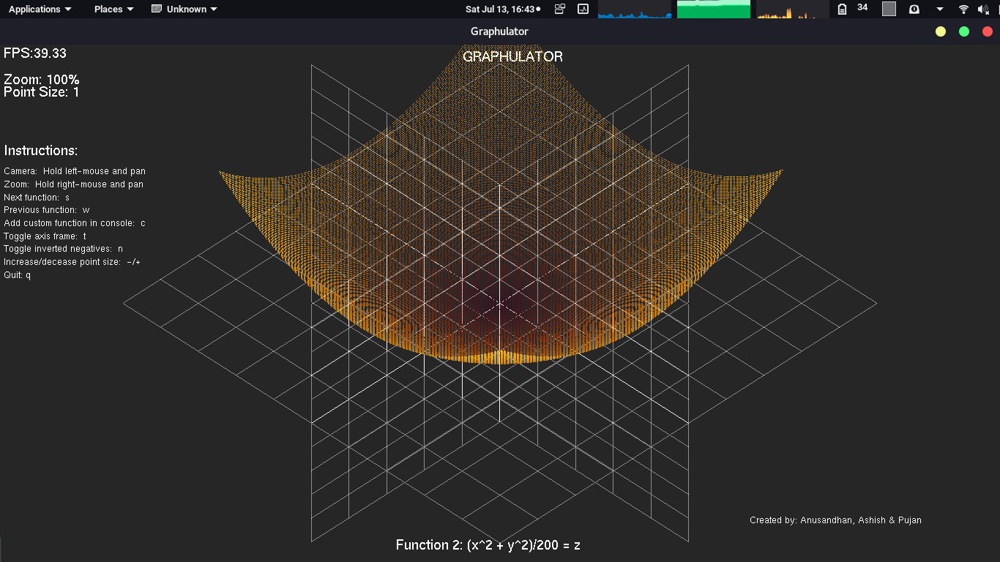
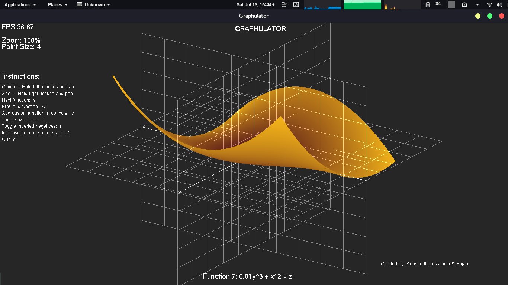
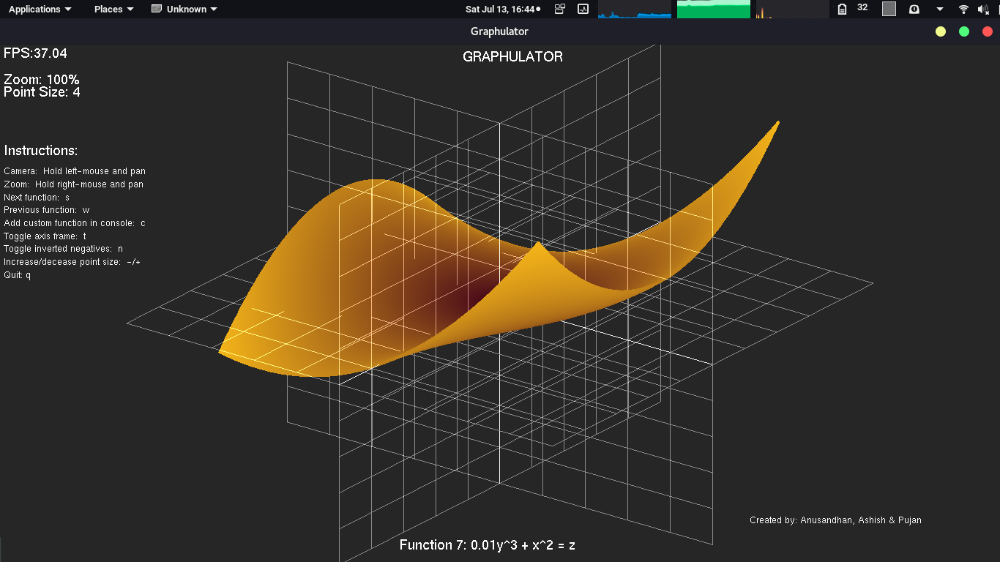
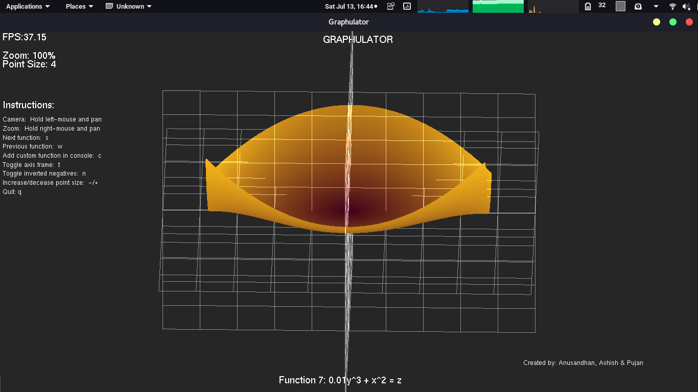

# Sem11OOP
## 3rd semester OOP Project on Graphulator.
> It is aimed to process all the calculating processes along with the Graphical presentation.

## Languages used:C++ and Graphics is targeted to use OpenGl specification.

